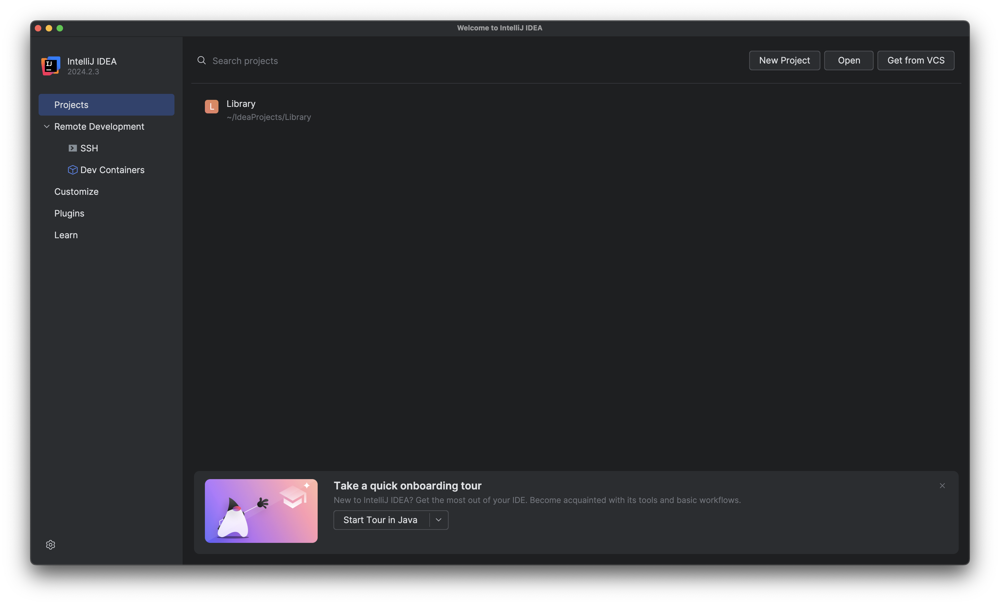
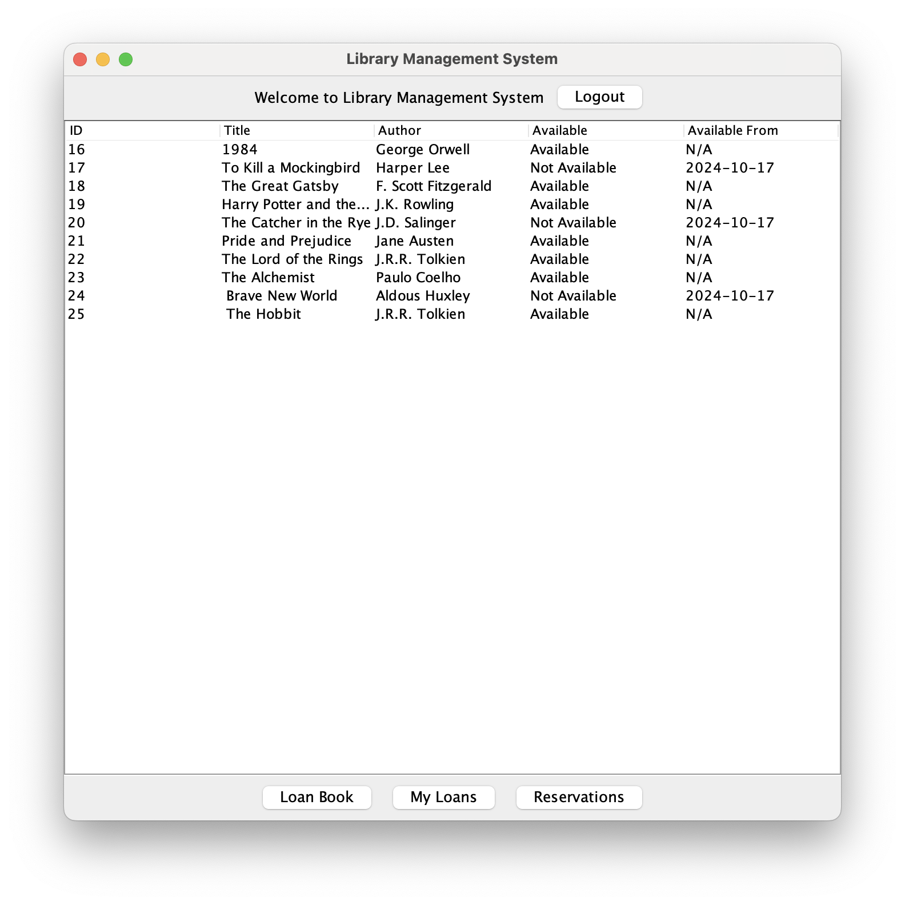

# Library Management Application 
This is a library management application that divides users into students and administrators.

## Functions
### Students 
- Students can borrow and return books.
- Students can reserve books that are currently unavailable.

### Administrators
- Administrators can add and remove books.
- Administrators can view and manage the list of users (add and remove users).
- Administrators can check the current list of all book reservations and loan history.

## Contents
- [Installation](#installation)
- [How to use](#how-to-use)
- [Login Data](#login-data)
- [Example for use](#example-for-use)
- [Contact](#Contact)


## Installation
1. First, you have to clone the repository:
   ```bash
   git clone https://github.com/WierzbaDev/Library-Management-Application.git

   ```

2. Next, run IntelliJ and create a new project.
   
  2.1 Then click the "Open" button and choose the Library folder in Library-Management-Application.
   

3. Open XAMPP.
  

 3.1 Go to the "Manage Servers" tab and start MySQL Database and Apache Web Server.
   
   
 3.2 Click the "Go to Application" button.
   
   
  3.3 Create a database called "library".
   
   
  3.4 Go to the "Import" tab and select the file ```library.sql```.
   

  3.5 Select the file library.sql and click the "Import" button.

  3.6 Congratulations! You have successfully imported the database!
    

Go to the Library project in IntelliJ and run ```Library/src/ui/MainApp.java```.
  

## How to use
You can log in using the provided login credentials below, or you can create your own account.

### Login Data
#### Student:
1. Email: mat.student@library.com Password: Student123
2. Email: art.student@library.com Password: Student123
#### Administrators:
1. Email: pio.admin@library.com Password: Admin123
2. Email: and.admin@library.com Password: Admin123

## Example for use
### 1. Login Panel

This is the login screen where users (Students and Administrators) can log in. If you want to create an account, click the "Register" button.

### 2. Student Panel

Here, students can view, borrow, and reserve books.

### 3. Administator Panel

Administrators can manage books and users, as well as review reservations and loan history.

## Contact
- Mateusz - [My github account](https://github.com/WierzbaDev)
